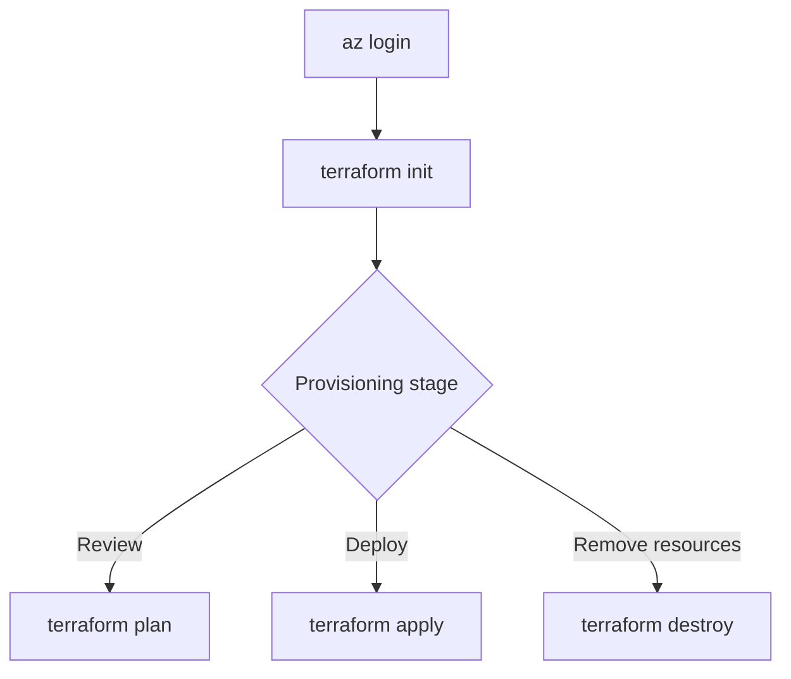

# Terraform Deployment

The Terraform template provisions the Azure resources required by this solution, including Storage, Document Intelligence, Cosmos DB, Application Insights, and the Function App.

## Template Files

| File | Purpose |
| --- | --- |
| `main.tf` | Defines the Azure resources and their relationships. |
| `variables.tf` | Declares configurable input values. |
| `provider.tf` | Configures the Terraform providers. |
| `terraform.tfvars` | Supplies deployment-specific values. |
| `outputs.tf` | Exposes created resource values. |

## Deployment Flow



!!! warning "Review deployment values"
    Update `terraform.tfvars` with environment-specific values before running Terraform. Review the plan before applying changes.

```sh
cd terraform-infrastructure
az login
terraform init
terraform plan -var-file terraform.tfvars
terraform apply -var-file terraform.tfvars
```

For screenshots, parameter guidance, and the complete Terraform walkthrough, see the [canonical Terraform guide](https://github.com/Cloud2BR-MSFTLearningHub/PDFs-Layouts-Processing-Fapp-DocIntelligence/blob/main/terraform-infrastructure/README.md).